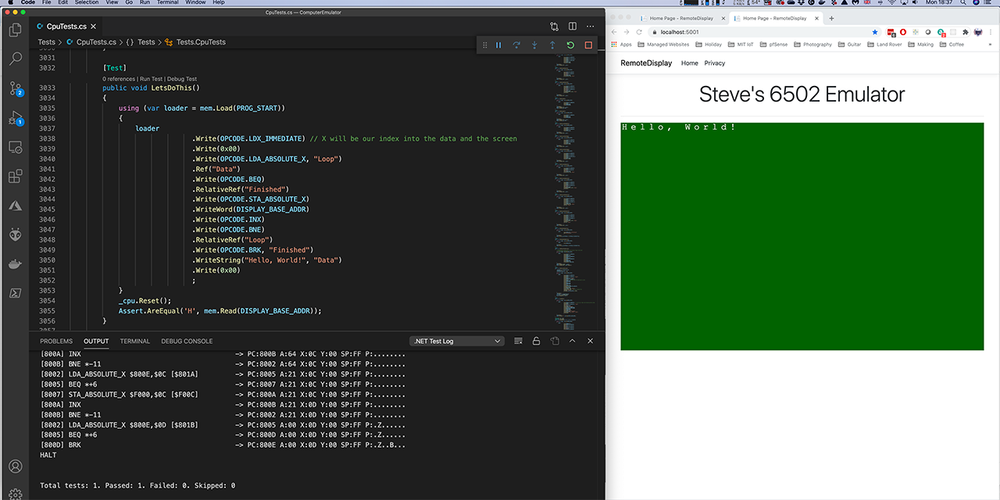

# Welcome to my '70s/'80s Computer Emulator

This is very much a fun, vanity project.

Like many people in IT, I grew up with the Home Computer boom of the late 1970s and early 1980s. I cut my teeth on the Commodore PET 3032 and really started to develop my skills with the introduction of the BBC Micro.

The 6502 was the processor of my formative years. I even spent considerable time designing and prototyping my own modular computer, based on the device.

I've spent the intervening decades working on all sorts of computer systems, from embedded microcontrollers to the largest mainframes. But my inspiration remains the 6502.

I develop mostly in C#, these days. I've used it since it was a beta product in 1999 and still feel most comfortable with it. But being a Mac user, more than a Windows user, these days, I prefer to target .NET Core. That's exactly what I've done with this project. Indeed, I have thus far developed and tested it entirely on a Mac. At some point, I'll test it on Windows and Linux.

Being able to capture this image made me very happy.

## What do we have?
### CPU Emulation
I have implemented an emulator for the 6502 CPU. Almost completely, except that I have not attempted to implement any of the original processor's quirks and I have not (yet) included support for BCD (decimal) mode arithmetic.

I should be able to add other CPU emulations, but there are some aspects (that I'm not proud of) that need refactoring first.

### Memory-Mapped I/O
I have implemented a modular 'address bus' called the AddressMap. You can install devices into the available memory space and the AddressMap will ensure that the appropriate address accesses are routed to the appropriate components.

Thus far, I have RAM, ROM and a very simple (but getting more sophisticated) Memory Mapped Display Adapter that can attach to a remote visualisation in a browser.

You can configure the bus, how you like. But the 6502 CPU won't work unless there's at least enough RAM for Zero Page, the Stack and, of course, your own program.

The AddressMap is layered, so you can install 64kB of RAM and then a 1kB display adapter into the middle of it.

## What can you do with it?
Well, it doesn't emulate any specific computer, so you can't load your favourite Commodore 64 game into it and start playing.

At the moment, you have to hand-crank code into it by writing directly to memory. I've added a useful fluent API that greatly reduces the amount of code that you have to write.

Examples are in the Tests project. 

The test suite is reasonably comprehensive and code coverage is much higher than I would normally expect to achieve.

## What's next?
I'm just getting started with the project and it's very early days. The code is not shockingly bad (by my standards, at least *haha*), so I've turned it over for public scrutiny, and wider contribution.
